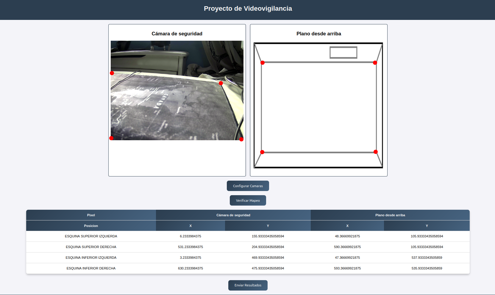
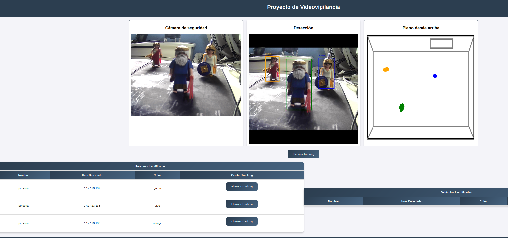

<h1 style="text-align: center;">-VIABA-VigilancIA-Computer-Vision-machine-learning</h1>

### Proyecto relacionado con el área de Inteligencia Artificial de la asignatura de Proyectos 4

### En este repositorio se almacenará el flujo de trabajo de aplicaciones relacionadas con el área de Data Science principalmente de proyectos de Computer Vision


<h1 style="text-align: center;">Forma de Trabajar</h1>

### La organización principal que se seguirá en el repositorio va dictaminada por el nombre del alumno y su carpeta

### El nombre de carpeta representa el workspace del alumno que la usara donde el mismo podrá tanto crear como modificar a su buena disposición el número de notebooks, herramientas que considere

### Se trabajará por ramas dejando así mismo la MAIN lo limpia de contenido sobrante como se pueda


### De tal manera que si un alumno quiere trabajar en una nueva implementación tendrá que crearse una rama independiente para guardar sus cambios hasta la finalización de la tarea

### Cuando dicha implementación esté finalizada podrá subir sus cambios a la rama MAIN

<h1 style="text-align: center;">Instalación</h1>

```bash
# Clonar Repositorio
git clone https://github.com/AntonioPayar/-VIABA-VigilancIA-Computer-Vision-machine-learning.git

#Crear entorno python
python3 -m venv entorno_proyectos_II
source entorno_proyectos_II/bin/activate

#Instalar Dependencias
pip install -r requirements_offline.txt

#Instalar ByteTrack (!DENTRO DEL PROYECTO!)
cd VigilancIA_FastAPI/src/

#Ejecutar FastAPI
uvicorn main:app --host 0.0.0.0 --port 8000 --reload

```
<h1 style="text-align: center;">Entrar Páginas</h1>

http://127.0.0.1:8000/static/configuration_page.html



http://127.0.0.1:8000/static/monitoring_page.html



